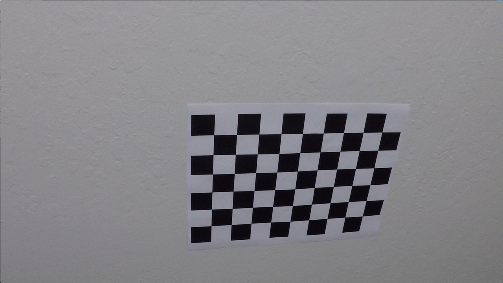
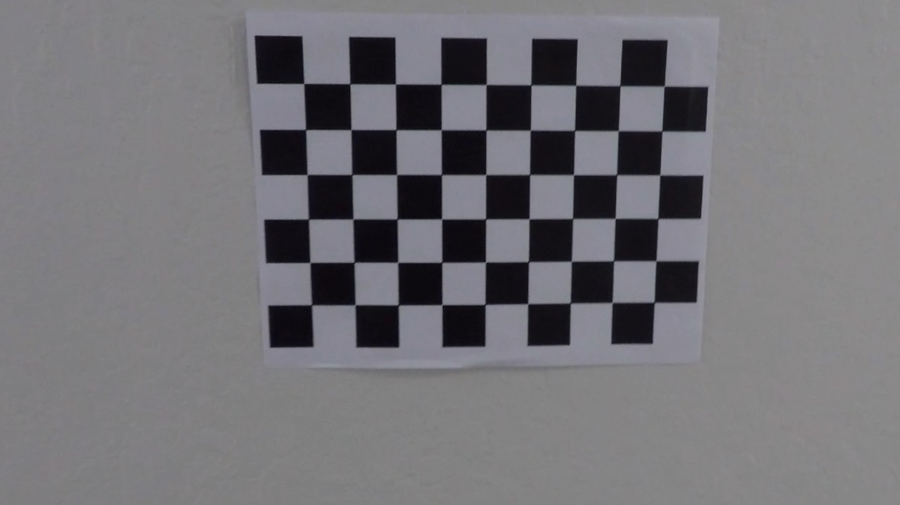

#  **Advanced Lane Finding**

The project goals were perform advanced lane finding using combination of steps outlined below:-

* Compute the camera calibration matrix and distortion coefficients given a set of chessboard images.
* Apply a distortion correction to raw images.
* Use color transforms, gradients, etc., to create a thresholded binary image.
* Apply a perspective transform to rectify binary image ("birds-eye view").
* Detect lane pixels and fit to find the lane boundary.
* Determine the curvature of the lane and vehicle position with respect to center.
* Warp the detected lane boundaries back onto the original image.
* Display of the lane boundaries and numerical estimation of lane curvature and vehicle position for a video

---

#### 1. Submission Files:

**Step 1:** Camera Calibration done via `cam_cal.py` 
**Step 2:** Tracking Window Search via  `tracker.py` 
**Step 4:** Image Generator for tweaking parameters `image_gen.py` 
**Step 4:** Final processing pipeline based on Image generator approach`video_gen.py` 

Identification of lanes in an image is quite an experimental process. Using few images allows for fasts iteration which can then be used for final video processing approach.

Downside of the approach is that images cannot capture all possible situations encountered in real driving and hence one has to test it out on the real video.

Critical code in `video_gen.py` is derived from `image_gen.py` hence the write refers to both interchangeably. 

___

### Camera Calibration

#### 1. Briefly state how you computed the camera matrix and distortion coefficients. Provide an example of a distortion corrected calibration image.

The code for camera calibration step includes:
  1) Generation of  parameters using cv2 `camera.Calibrate()` function in line 41 of  `cam_cal.py` 
  2) Storage the camera calibration factors in the pickle fine in line 46 of `cam_cal.py`
  3) Loading of the camera calibration factors by loading the pickle file in line 15 in `image_gen.py`  
  4) Usage of the camera calibration factors in line 132 in `image_gen.py`

I start by preparing "object points", which will be the (x, y, z) coordinates of the chessboard corners in the world. Here I am assuming the chessboard is fixed on the (x, y) plane at z=0, such that the object points are the same for each calibration image.  Thus, `objp` is just a replicated array of coordinates, and `objpoints` will be appended with a copy of it every time I successfully detect all chessboard corners in a test image.  `imgpoints` will be appended with the (x, y) pixel position of each of the corners in the image plane with each successful chessboard detection.  

I then used the output `objpoints` and `imgpoints` to compute the camera calibration and distortion coefficients using the `cv2.calibrateCamera()` function. Calibrated camera data is saved in file 'calibration_pickle.p'  

Here is the example of calibration in action:- 

*Original Image*

*Camera Calibrated Image*

___

### Pipeline (single images)

#### 1. Provide an example of a distortion-corrected image.
I applied camera distortion correction to the test image using the `cv2.undistort()` function. To demonstrate this step, following pair of images show the distortion correction in action:-

*Original Image*

*Undistorted Image*

#### 2. Describe how (and identify where in your code) you used color transforms, gradients or other methods to create a thresholded binary image.  Provide an example of a binary image result.
I experimented with multiple techniques and approaches for generating binary thresholded images. Some of the approaches can be seen in commented section of my code (between lines 137 through 146).

Refer to the below listed functions in file `image_gen.py`I tried multiple color thresholding approaching including using red channel as well as gray images as seen in the function `color_thresh1()`starting at line 71. Additionally I explored isolating the HSL parameters to do the thresholding as shown in my function `color_thresh2()` starting at line 100. 

Finally I used following set of threshold parameters to isolate binary image.
 `preprocessImage = np.zeros_like(img[:,:,0])
   gradx = abs_sobel_thresh(img,orient='x',thresh=(20,100)) 
   grady = abs_sobel_thresh(img,orient='y',thresh=(25,255)) 
   c_binary = color_thresh1(img, sthresh=(100,255), vthresh=(50,255))
  preprocessImage[((gradx == 1) & (grady ==1) | (c_binary==1))] = 255`

After much experimentation I ended up using values above.

Here's an example of my output for this step:

*Original Image*

*Binary Image*

Here is the example based on updated thresholding:
*Update Binary Image*

#### 3. Describe how (and identify where in your code) you performed a perspective transform and provide an example of a transformed image.

The code for my perspective transform is in line 174-189 of `image_gen.py`and reproduced below:-
<pre><code>
src = np.float32([[230, 700], [1200, 700], [680, 450], [600, 450]])
dst = np.float32([[310, 710], [960, 710], [960, 10], [310, 10]])
M = cv2.getPerspectiveTransform(src, dst)
Minv = cv2.getPerspectiveTransform(dst,src)
warped = cv2.warpPerspective(preprocessImage, M, img_size, flags=cv2.INTER_LINEAR)
</code></pre>

My source and destination points were hard coded as shown above and shown in the following table:-

| Source        | Destination   | 
|:-------------:|:-------------:| 
| 230, 700		| 310, 710        | 
| 1200, 700     | 960, 710      |
| 680, 450      | 960, 10      |
| 600, 450      | 310, 10        |

The approach listed below from project Q&A did not seem to work for me so I commented the code out.

<pre><code>
  img_size = (img.shape[1], img.shape[0])
  bot_width = 0.76
  mid_width = 0.08
  height_pct = 0.62
  bottom_trim = 0.935
  src = np.float32([[img.shape[1]*(0.5-mid_width/2),img.shape[0]*height_pct],[img.shape[1]*(0.5+mid_width/2),img.shape[0]*height_pct],
      [img.shape[1]*(0.5+bot_width/2),img.shape[0]*bottom_trim], [img.shape[1]*(0.5-bot_width/2),img.shape[0]*bottom_trim]])
  offset = img_size[0]*0.25
  dst = np.float32([[offset, 0], [img_size[0]-offset, 0], [img_size[0]-offset, img_size[1]], [offset, img_size[1]]])
</code></pre>

Following shows the output of the perspective transform on the listed *Original Image* below.

*Original Image**

*Warped Image*

My warped lane was not quite as parallel as I would like to have seen them. Hence I played with source and destination coordinates and landed up on the following:-
<pre><code>
src = np.float32([[585, 450], [203, 720], [1127, 720], [685, 450]])
dst = np.float32([[320, 0], [320, 720], [960,720], [960, 0]])
</code></pre>

Here is the updated warped image which looks much better.
* Updated Warped Image*

#### 4. Describe how (and identify where in your code) you identified lane-line pixels and fit their positions with a polynomial?

Left and right polynomial fit areshow in line  line 226 through 234  of `image_gen.py`:

*Original Image*

*Polynomial Image*

*Polynomial Image*

#### 5. Describe how (and identify where in your code) you calculated the radius of curvature of the lane and the position of the vehicle with respect to center.

I did this in lines 259-261 in my code in `image_gen.py`. I used left lane for calculation of the radius of curvature instead of shooting for more complex averaged lane of left and right lanes. 

#### 6. Provide an example image of your result plotted back down onto the road such that the lane area is identified clearly.

I implemented this step in lines 244-254 in `image_gen.py`.  Here is the final example of my result on the test image with all the updated thresholding and slope calculations applied. 

#### 7. Radius of calculation for the first curve
The radius of curvature of the first curve is shown below and very close to 1mile (~1.59km) as expected.

### Pipeline (video)

#### 1. Provide a link to your final video output.  Your pipeline should perform reasonably well on the entire project video (wobbly lines are ok but no catastrophic failures that would cause the car to drive off the road!).

Here's my [video result of the original processing](https://youtu.be/CNFYV0gwk6A	). This corresponds to the `output1_fixed_0927` video in my submission directory. All frames identify the lanes properly.

Here is my complete pipeline: 

All the videos including outout of the challenge videos are also stored in my github repo. 

### Discussion

There are multiple areas where I had to experiment in to get the project video work well. One of the difficulties with this project is that the sample images are not as hard as the images generated from the challenge videos. The tweaks on the images are fast since you are working only with handful of images, however, the feedback of your video output takes a while. This makes the process of iteration on the challenge video tedious.

However some of the areas I played with are listed below:-

 - Generating binary image requires looking at different channels (RGB), (HSV), (HSL) as well as gradients and magnitude
 - Setting up trapezoid shape for perspective transform is critical to getting lane lines as parallel as they can be to ensure proper identification using subsequent steps
 - Window sliding parameter as well as size of the windows for identifying the lanes by using maximum pixel approach is tricky. I had to play with multiple values to get lanes stable in the project video. 
 - I tried masking approach (lines 125-147, `region_of_interest` function as well to see if the lines at the edges which interfere could be removed.
 - Since none of the ideas have worked on the challenge videos, first thing I will approach this via is to look at the problematic frames in all different color channels. I will also use magnitude and direction thresholds to really isolate the lines which are the lane markers. This iteration requires deeper and longer study which currently I am pursuing while I also want to submit the assignment on time. 